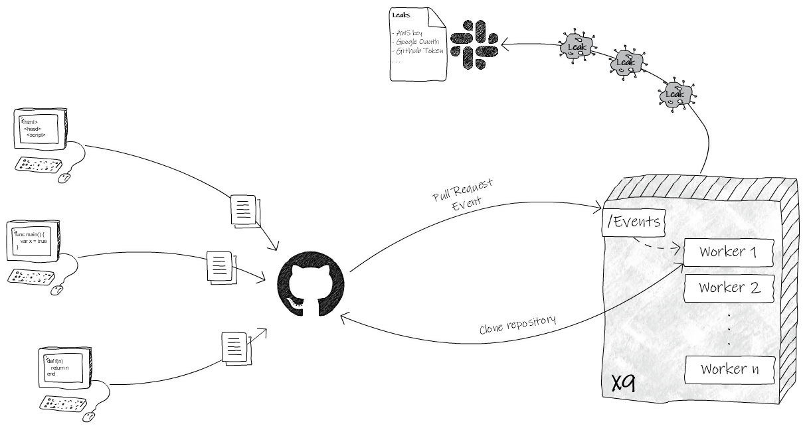

  

## X9: Static analysis in real-time

  

X9 is a simple static analysis tool that helps find potential sensitive data leaks. It integrates with Github webhooks to receive Pull Request events and can send the results to slack.

  

### How it works
  

Developers are constantly creating new features making it hard for security teams to manually analyze every piece of code. The purpose of this project is to bring automation to find potential sensitive data exposure in the development process.

  

Let's suppose that we have a development team working on a new feature. At some point, they make a new Pull Request. Github will receive it and it will notify X9 by sending the Pull Request data to X9 `/events` route.

  

X9 has many workers, which can be configured to deal with a great number of requests. It will send this event to one of the workers that are responsible for performing the tests. First, the worker will clone the repository in a temporary folder. Then it will analyze every single file searching for a match on one of the configured signatures. When it finds a match, it logs to `stdout` and sends it to slack through a configured webhook.

  
  

  
  

### Customize

#### General configuration

The following parameters can be configurated by editing the `config.yaml` file:

| name | type | description |
|--|--| -- |
| num_threads | int | number of workers that x9 will initialize|
| debug_mode | bool | sets the log level to debug |
|minimum_file_size | int | minimum file size that x9 will test |
|maximum_file_size | int | maximum file size that x9 will test |
| clone_repository_timeout | int | maximum duration in seconds to clone a repository     |
| blacklisted_repositories | list of strings| list of repositories in the format `Organization/Repository` that x9 will skip  |

#### Signatures
  

Signatures are regular expressions that X9 will use to found potential sensitive data in your code. X9 has some default signatures but you can disable or add new ones by editing `sast/config.yaml` file.

Signatures have some fields that you need to set:

  | name | type | description |
|--|--| -- |
| part | string |  the resource type x9 will apply the regex. It has to be set with one of the following possible values (*extension* \| *path* \| *filename* \| *contents* ) |
| regex | string | The regular expression that will be used to match values in the respective resource. |
| name | int |  Vulnerability name that will be displayed on the report. |
